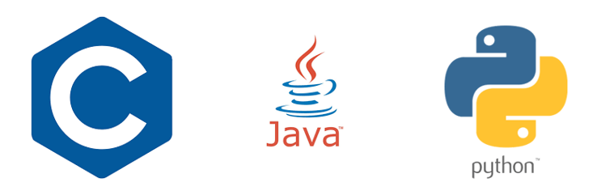

# Resume
---

**이시현(SEEHYUNLEE)**  

>대학교 : [한림대학교](https://www.hallym.ac.kr/)  
>>소속 : 소프트웨어융합대학  
>>>전공 : 빅데이터 전공  
>>>복수전공: 콘텐츠IT   

*현재 2학년 재학중*  

생년월일 : 2000.11.19  
이메일 : dltlgus1119@naver.com

---  
### 관심분야
* **게임 개발**  

*사용해본 게임엔진*  
→ Unity  
  
>좋아하는 게임  
>>[MapleStory](https://maplestory.nexon.com/Home/Main)  
>>[League of Legends](https://www.leagueoflegends.com/ko-kr/)  
>>Tekken7  

  

* **인공지능**  

---  

### 프로그래밍 언어
1. C
2. Java
3. Python

    
---  
### 성적
**1학년 1학기**  
|과목|학점|성적|
|:---:|:---:|:---:|
|자바프로그래밍1|3|B+|
|이산구조론|3|A+|
|컴퓨팅사고와문제해결|2|A+|
|대학영어3|3|A0|
|서양미술의이해|3|A+|
|음악의이해|3|B+|
|오디세이세미나1|1|P|
|한림퍼스트원|1|P|
|소프트웨어세상속으로|1|P|
|**평점**||**4.06**|

**1학년 2학기**
|과목|학점|성적|
|:---:|:---:|:---:|
|창의코딩웹|3|A+|
|자바프로그래밍2|3|A+|
|선형대수|3|A+|
|사고와표현|3|A+|
|대학영어4|3|A0|
|현대생활과운동|3|B+|
|**평점**||**4.25**|

**2학년 1학기**
|과목|학점|성적|
|:---:|:---:|:---:|
|오디세이세미나2|1|P|
|자료구조|3|A+|
|C프로그래밍|3|A+|
|파이썬과학프로그래밍기초|3|A+|
|데이터사이언스기초|3|A+|
|논리설계및실험|3|B+|
|**평점**||**4.3**|

---  
### 교육 프로그램
*수료한 프로그램*  
|연도|프로그램명|
|:---:|:---:|
|2020년|신입생 몰입형 SW코딩캠프|
|2021년|SQL과 자바 데이터 베이스 프로그래밍|
|2021년|Introduction to Intelligent Algorithms for Automated Vehicle System|
|2021년|ASIC Design and Verfication|
|2021년|선배가 바라는 SW신입사원|
|2021년|오픈소스 개요|
|2021년|제품 내장형 AI 동향|
|2021년|블록체인 기술의 동작 원리|
|2021년|Personalization|

---

### 학력사항

|학교명|졸업년도|주소|
|:---:|:---:|:---:|
|[대치초등학교](https://daechi.sen.es.kr/index.do)|2012|[서울특별시 강남구 양재천로 363](https://map.naver.com/v5/entry/place/12441136?c=14144005.4896244,4507808.6179198,15,0,0,0,dh)|
|[대청중학교](https://daecheong.sen.ms.kr/index.do)|2015|[서울특별시 강남구 양재천로 321](https://map.naver.com/v5/entry/place/12240238?c=14143605.4073744,4507698.0630691,15,0,0,0,dh)|
|[중대부고](https://cau.sen.hs.kr/index.do)|2018|[서울특별시 강남구 선릉로 207](https://map.naver.com/v5/entry/place/36502424?c=14219061.7546038,4562578.1544267,15,0,0,0,dh)|

---  
